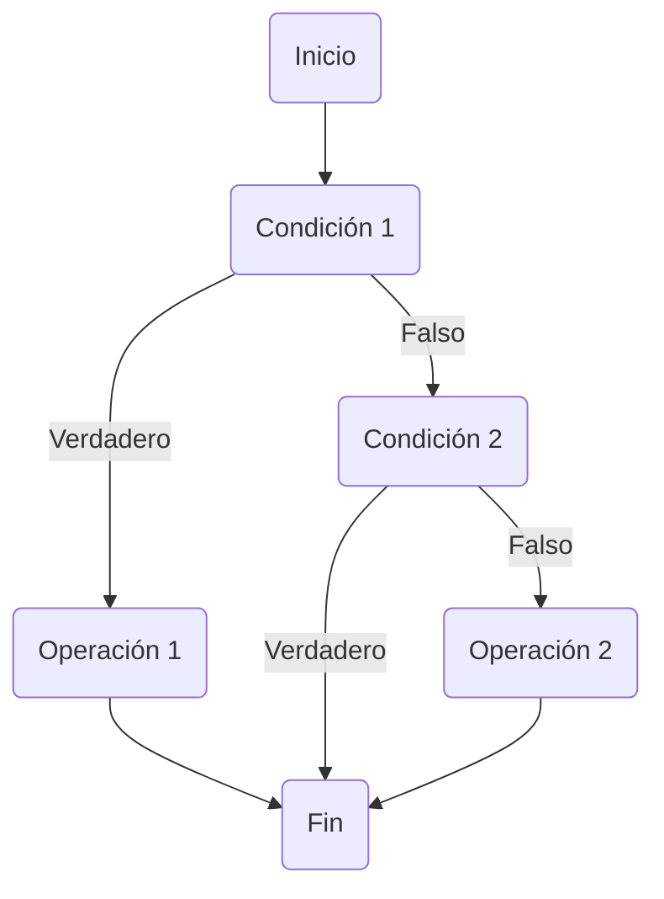

# Complejidad ciclomática

La complejidad ciclomática es una medida que se utiliza para cuantificar la complejidad estructural de un programa de software. Fue desarrollada por Thomas J. McCabe en 1976 y se basa en el número de caminos independientes que existen en un grafo que representa la estructura del programa.

A continuación se presentan tres formas de calcular la complejidad ciclomática:

**Fórmula de McCabe**: Esta es la forma más común de calcular la complejidad ciclomática y se basa en la cantidad de decisiones que existen en el código fuente del programa. La fórmula es la siguiente:
> **M = E - N + 2P**

Donde:

> - M = complejidad ciclomática
> - E = número de aristas del grafo
> - N = número de nodos del grafo
> - P = número de componentes conexos (porciones separadas del grafo)

Esta fórmula se basa en el hecho de que la complejidad ciclomática está relacionada con el número de decisiones que hay en el código. Cada decisión representa una bifurcación en el grafo, lo que aumenta la complejidad.

**Contar los puntos de decisión:** Otra forma de calcular la complejidad ciclomática es contar los puntos de decisión que existen en el código fuente. Los puntos de decisión son los lugares donde el flujo del programa se bifurca en dos o más caminos diferentes. Cada punto de decisión incrementa la complejidad en uno.

**Método del grafo de flujo de control:** Este método consiste en construir un grafo de flujo de control que representa la estructura del programa. Cada nodo en el grafo representa un bloque de código y las aristas representan las transferencias de control entre los bloques. La complejidad ciclomática se calcula contando el número de regiones que hay en el grafo, es decir, áreas limitadas por ciclos y puntos de decisión. Cada región incrementa la complejidad en uno.

## Ejemplo

grafo de ejemplo creado con Mermaid que representa un algoritmo con cinco nodos:

Este grafo representa un algoritmo con dos decisiones condicionales (Condición 1 y Condición 2), dos operaciones (Operación 1 y Operación 2), y un inicio y fin. La complejidad ciclomática es una métrica que mide la cantidad de caminos independientes a través del grafo, lo que nos permite estimar la complejidad del algoritmo. Hay varias formas de calcular la complejidad ciclomática, y aquí te muestro tres de ellas:

### Método de McCabe:
La fórmula para calcular la complejidad ciclomática según McCabe es:
**V(G) = E - N + 2 * P**
donde:
V(G): Complejidad ciclomática
E: Número de aristas (conexiones entre nodos)
N: Número de nodos
P: Número de nodos iniciales (en nuestro caso, solo hay uno: Inicio)
Para nuestro grafo:
E = 7 (conexiones entre nodos)
N = 6 (nodos)
P = 1 (nodo inicial)  

Entonces, *V(G) = 7 - 6 + 2 * 1 = 3.*

### Método de decisiones + 1:
En este método, se cuenta el número de decisiones (condiciones) en el grafo y se suma 1. En nuestro grafo, hay 2 condiciones (Condición 1 y Condición 2), por lo que la complejidad ciclomática es:  
*V(G) = 2 + 1 = 3.*

### Método de regiones:
Este método se basa en la idea de que un grafo se puede dividir en regiones cerradas y abiertas. La complejidad ciclomática es igual al número de regiones cerradas más 1. En nuestro grafo, hay 2 regiones cerradas (una alrededor de Condición 1 y otra alrededor de Condición 2). Por lo tanto, la complejidad ciclomática es:
*V(G) = 2 + 1 = 3.*